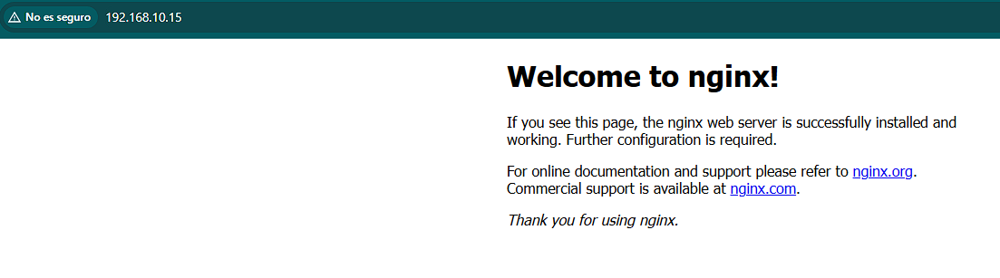
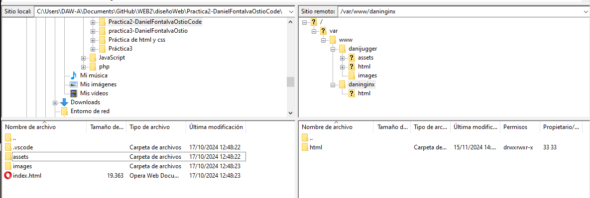

# Guía del Script de Provisión

IMPORTANTE: La mayor parte de los commits para este proyecto se realizaron en el siguiente repositorio donde se encuentran la mayoría de proyectos del ciclo formativo, ya que no realicé este proyecto en un repositorio independiente hasta más tarde. El repositorio en cuestión es [WEB2](https://github.com/Danielfo684/WEB2).

Este script `provision.sh` configura un servidor Debian con Nginx, Git y un servidor FTP seguro (`vsftpd`). También prepara dos sitios web independientes para alojarse en el servidor. A continuación, se explica cada sección del script y su funcionalidad.

## Instrucciones Paso a Paso

### Actualización e Instalación de Nginx
```bash
sudo apt update
sudo apt install -y nginx
```
- Actualiza las listas de paquetes e instala Nginx.

### Instalar y Actualizar Paquetes Adicionales
```bash
sudo apt-get upgrade -y
sudo apt-get install -y vsftpd git
```
- Actualiza los paquetes instalados a la última versión e instala `vsftpd` (un servidor FTP) y Git.

### Verificación del Estado de Nginx
```bash
systemctl status nginx
```

### Creación del Directorio para el Primer Sitio Web
```bash
sudo mkdir -p /var/www/daninginx/html
```
- Crea la estructura de directorios para el primer sitio web.

### Clonación del Repositorio del Sitio Web
```bash
sudo git clone https://github.com/cloudacademy/static-website-example /var/www/daninginx/html
```
- Clona un repositorio de sitio web estático en el directorio recién creado.

### Asignación de Permisos
```bash
sudo chown -R www-data:www-data /var/www/
sudo chmod -R 775 /var/www/
```
- Asigna la propiedad y los permisos adecuados al directorio `/var/www/` para asegurar el acceso correcto del usuario `www-data`.

### Configuración de Nginx para el Primer Sitio Web
```bash
sudo bash -c 'cat > /etc/nginx/sites-available/daninginx <<EOF
server {
    listen 80;
    listen [::]:80;
    root /var/www/daninginx/html;
    index index.html index.htm index.nginx-debian.html;
    server_name www.daninginx.test;
    location / {
        try_files $uri $uri/ =404;
    }
}
EOF'
```

### Crear un Enlace Simbólico para Nginx
```bash
sudo ln -s /etc/nginx/sites-available/daninginx /etc/nginx/sites-enabled
```
- Habilita la configuración del sitio creando un enlace simbólico en `sites-enabled`.

### Reiniciar Nginx
```bash
sudo systemctl restart nginx
```
- Reinicia el servicio de Nginx para aplicar la nueva configuración.

### Modificar el Archivo `hosts`
Este paso es fundamental para que funcione: debe modificarse el archivo añadiendo la IP y la dirección web del servidor
```
192.168.10.15 www.daninginx.test
192.168.10.15 www.danijugger.test
```
- Esto permite que tu ordenador reconozca el dominio.

### Verificación del sitio web



### Crear un Segundo Directorio de Sitio Web y asignarle permisos
```bash
sudo mkdir -p /var/www/danijugger/html
sudo chown -R www-data:www-data /var/www/danijugger/html
sudo chmod -R 775 /var/www/danijugger
```

### Crear Configuración de Nginx para el Segundo Sitio Web
```bash
sudo bash -c 'cat > /etc/nginx/sites-available/danijugger <<EOF
server {
    listen 80;
    listen [::]:80;
    root /var/www/danijugger/html;
    index index.html index.htm index.nginx-debian.html;
    server_name www.danijugger.test;
    location / {
        try_files $uri $uri/ =404;
    }
}
EOF'
```
- Configura Nginx para servir el segundo sitio web en `www.danijugger.test`.

### Habilitar el Segundo Sitio Web
```bash
sudo ln -s /etc/nginx/sites-available/danijugger /etc/nginx/sites-enabled
```

### Modificar el Archivo `hosts`
Agrega la siguiente entrada al archivo `hosts` de la máquina anfitriona (`/etc/hosts`) para mapear la dirección IP del servidor a los nombres de dominio:
```
<ip-del-servidor> www.danijugger.test
```
- Esto permite que tu ordenador reconozca el dominio.

### Crear un Nuevo Usuario para FTP
```bash
sudo adduser dani
echo "dani:dani" | sudo chpasswd
```

### Agregar Usuario al Grupo `www-data`
```bash
sudo usermod -aG www-data dani
```
- Añade `dani` al grupo `www-data` para los permisos de acceso.

### Crear Directorio para el Servidor FTP y traspaso de datos por Filezilla
```bash
sudo mkdir /home/dani/ftp
sudo chown dani:dani /home/dani/ftp
sudo chmod 775 /home/dani/ftp
sudo chown david:www-data /home/dani/ftp
```
### Verificación del sitio web



### Actualizar la Configuración de `vsftpd`
```bash
sudo cp /vagrant/vsftpd.conf /etc/vsftpd.conf
```
- Reemplaza la configuración existente de `vsftpd` con el archivo de configuración personalizado.

## Cuestiones Finales

### ¿Qué pasa si no hago el link simbólico entre `sites-available` y `sites-enabled` de mi sitio web?
Si no se crea el enlace simbólico, Nginx no cargará la configuración de tu sitio web y no estará disponible al acceder a la dirección del servidor. `sites-enabled` es el directorio que Nginx usa para activar los sitios, por lo que es esencial para que funcione y no de error.

### ¿Qué pasa si no le doy los permisos adecuados a `/var/www/nombre_web`?
Si los permisos no son correctos, Nginx pierde el acceso a archivos del sitio web, dando errores de acceso denegado o páginas que no se cargan correctamente. Esto podría afectar la capacidad del servidor para servir los archivos del sitio a los usuarios.
